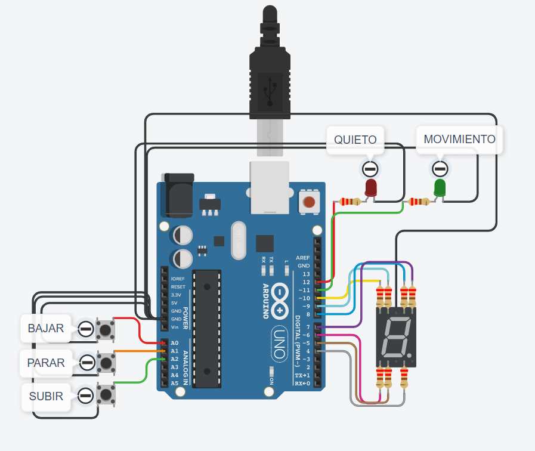
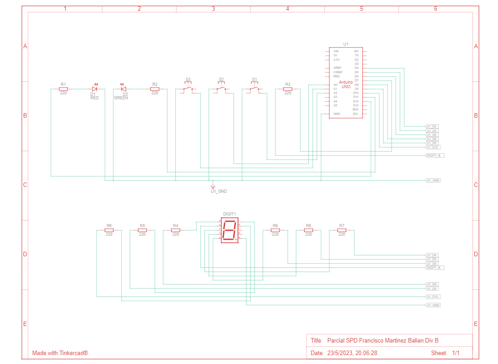

# Documentación SPD Primer Parcial

# Proyecto: Ascensor

## Descripción
Este proyecto se creó con la intención de lograr un ascensor que permita al usuario subir, bajar o detenerse, cuando lo precise. También se utilizan dos leds para saber si el ascensor está o no en movimiento y por último, se utiliza un display 7 segmentos para mostrar en que piso se encuentra.

# Diagrama Esquemático

En la parte inferior del diagrama, se puede observar el display 7 segmentos junto con sus conexiones correspondientes hacia la placa de arduino. Además, se puede ver sus resistencias las cuales se encuentran en 220Ω. Hay una conexión más en la parte superior, la cual corresponde al pin 7. Estos segmentos, cumplen la función de indicar en que piso se encuentra el ascensor

En la parte superior, podemos encontrar a la placa de arduino y sus conexiones, y a su izquierda, se encuentran los 3 botones INPUT_PULLUP, los cuales por un lado están conectados a GND y por el otro al pin correspondiente. El botón de bajar, indica que el ascensor tiene que bajar, el de parar indica que se tiene que parar, y el de subir indica que hay que subir. Además, a sus lados se encuentran dos leds, uno rojo y un verde, los cuales indican el movimiento del ascensor (rojo es quieto y verde es movimiento).

## Función principal: estadoAscensor(int subida, int bajada, int pausado, int primerPiso, int ultimoPiso)
Esta funcion se encarga de indicar el estado del ascensor, es decir, si va a estar subiendo, bajando o quieto. Además, se muestra el estado por el serial.
- subida corresponde al estado del botón de subir. Si se presiona, el estado pasa a ser 0, y si el ascensor no se encuentra en el último piso, este sube. 
- bajada corresponde al estado del botón de bajar. Si se presiona, el estado pasa a ser 0, y si el ascensor no se encuentra en el primer piso, este baja. 
- pausado corresponde al estado del botón de pausar. Si se presiona, el estado pasa a ser 0, y el ascensor se detiene.
- primerPiso corresponde al piso inicial el cual es el 0.
- ultimoPiso corresponde al piso final el cual es el 9.

~~~ C (lenguaje en el que esta escrito)

estadoAscensor(lecturaSube, lecturaBaja, lecturaPausa, 0, 9);//llamada a la funcion

void estadoAscensor(int subida, int bajada, int pausado, int primerPiso, int ultimoPiso)
{
  if(subida == 0 && numeroDePiso < ultimoPiso)
  {
    estadoDelSistema = 1; //Sube
    Serial.println("Subiendo");
  }
  else if(bajada == 0 && numeroDePiso > primerPiso)
  {
    estadoDelSistema = -1; //Baja
    Serial.println("Bajando"); 
  }
  else if(pausado == 0)
  {
    estadoDelSistema = 0; //Se queda quieto
    Serial.println("Ascensor quieto");
  }
}
~~~
## :robot: Link al proyecto
- [Proyecto de Tinkercad](https://www.tinkercad.com/things/dvZore1MPWP)
